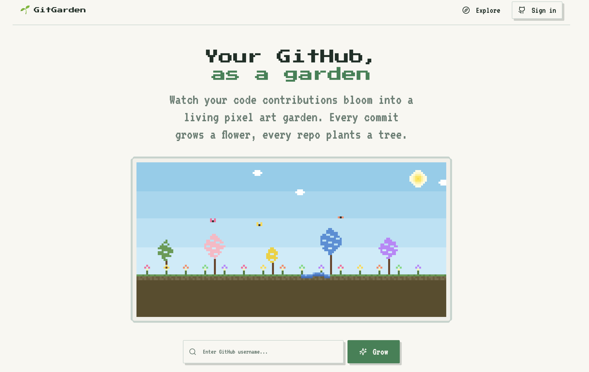

# 🌿 GitGarden

**Your GitHub contributions as a living garden.**

Every commit grows a flower. Every repo plants a tree. Long streaks bloom sunflowers. The more you code, the more your garden thrives.



---

## How it works

Visit `gitgarden.io/your-username` and watch your garden grow based on your real GitHub contribution data.

| GitHub activity                    | Garden element    |
| ---------------------------------- | ----------------- |
| Recent commit density (last 90d)   | 🌸 Flowers        |
| Repositories                       | 🌳 Trees          |
| Repositories                       | 🌿 Bushes         |
| Longest streak > 30 days           | 🌻 Sunflowers     |
| Current streak < 3 days            | 🍄 Mushrooms      |
| 200+ total commits                 | 🦋 Butterflies    |
| 500+ total commits                 | 🐦 Birds          |
| Had long streak, now inactive      | 🍂 Falling leaves |
| 10+ followers (1 per 10, max 3)    | 🦔 Hedgehogs      |
| 100+ followers (1 per 100, max 2)  | 🦌 Deer           |
| 1000+ followers                    | 🦊 Fox            |

Gardens update every 24 hours. No login required to view — just enter any GitHub username.

---

## Tech stack

- **Frontend** — React + Vite + TypeScript
- **Styling** — Tailwind CSS + shadcn/ui
- **Database & Functions** — Supabase (PostgreSQL + Edge Functions)
- **GitHub data** — GitHub GraphQL API
- **Hosting** — Cloudflare Pages

---

## Running locally

```bash
# Clone the repo
git clone https://github.com/MonicaFidalgo/git-garden.git
cd git-garden

# Install dependencies
npm install

# Set up environment variables
cp .env.example .env
# Fill in your Supabase URL and anon key

# Run the dev server
npm run dev
```

Open [http://localhost:8080](http://localhost:8080) to see your garden.

---

## Environment variables

Create a `.env` file with:

```env
VITE_SUPABASE_URL=https://your-project.supabase.co
VITE_SUPABASE_ANON_KEY=your-anon-key
```

For the Edge Function, set the following secret in Supabase:

```
GITHUB_TOKEN=your-github-personal-access-token
```

The token only needs `read:user` and `read:org` scopes.

---

## Deploying the Edge Function

```bash
npx supabase login
npx supabase functions deploy github-garden
npx supabase secrets set GITHUB_TOKEN=your-token
```

---

Built with 🌱 by [@MonicaFidalgo](https://github.com/MonicaFidalgo)
